# 🩺 NurseFlow AI

> An open-source AI-assisted nursing workflow prototype for hands-free clinical event capture, structured nursing documentation, and EMR-oriented workflow support.


---

## 📌 About the Project

**NurseFlow AI** is an open-source prototype that explores how artificial intelligence can support nurses during clinical workflows without replacing professional nursing judgment.

The project began from a nursing student's perspective.

During nursing education and clinical practice, nurses are expected to observe patients, perform nursing interventions, communicate with other healthcare professionals, and document what happened accurately. However, documentation and information entry can interrupt the flow of patient care and create additional cognitive workload.

NurseFlow AI explores a different workflow:

> **Capture what happens during nursing care, allow AI to organize the information, and require a nurse to review and approve the resulting record.**

The long-term concept is a hands-free workflow that could work with wearable devices such as smart glasses. The current software implementation serves as a prototype for testing the underlying workflow, permissions, AI processing, and documentation structure.

The project is designed around one important principle:

> **AI assists with documentation. The nurse remains responsible for reviewing and approving the clinical record.**

---

## 🎯 Problem

Nurses frequently perform multiple tasks while simultaneously observing changes in a patient's condition.

Important information may need to be remembered and documented later, including:

- patient observations
- nursing interventions
- medication-related events
- vital-sign assessments
- changes in patient condition
- communication and handoff information

Traditional documentation workflows may require nurses to stop what they are doing and manually enter information into a workstation or other system.

NurseFlow AI investigates whether AI-assisted event interpretation and structured documentation can reduce this friction while keeping the nurse in control of the final record.

---

## ✨ Key Features

### 🤖 AI-Assisted Nursing Documentation

Clinical events and contextual information can be sent to the AI backend and transformed into a structured draft nursing record.

AI-generated records are treated as **drafts**, not final clinical documentation.

---

### ✅ Nurse Review and Approval

Generated nursing records follow a review-oriented workflow.

Records can remain in a state such as:

```text
DRAFT_PENDING_REVIEW
```

until they are reviewed and approved by an authorized nurse.

This design keeps human clinical judgment in the workflow rather than allowing AI-generated content to become a final record automatically.

---

### 👩‍⚕️ Role-Based Nurse Access

NurseFlow AI includes Firestore security rules designed around authenticated and approved nursing users.

The current prototype supports concepts such as:

- authenticated nurse accounts
- approved nurse profiles
- session participants
- active nurse assignment
- restricted access to nursing records
- controlled write permissions

---

### 🔄 Nursing Session and Handoff Workflow

A nursing session can contain multiple approved participants while maintaining one active nurse responsible for the current workflow.

The prototype includes support for:

- nursing session creation
- participant management
- active nurse control
- nurse-to-nurse handoff history
- session status tracking

---

### 📝 Structured Nursing Events

Nursing events are stored separately from finalized nursing records.

Each event can contain contextual information such as:

- session
- patient
- nurse
- event type
- clinical context

These events can later be used as structured input for AI-assisted documentation.

---

### 🏥 EMR-Oriented Transfer Workflow

The prototype also explores a controlled workflow for transferring approved nursing records toward an EMR-oriented process.

Only approved records are intended to proceed to the transfer stage.

Transfer records can include information such as:

- nursing record reference
- nurse identity
- patient reference
- record version
- signature hash
- transmission state

> NurseFlow AI does not currently connect to a production hospital EMR. The EMR functionality in this repository represents a prototype workflow.

---

### 🎙 Camera and Voice-Oriented Interaction

The project architecture includes camera and microphone permissions as part of its exploration of hands-free nursing workflows.

The long-term goal is to minimize manual interaction and allow nursing events to be captured more naturally during care.

---

## 🏗 Architecture

```mermaid
flowchart LR
    A[Camera / Voice / User Input]
    --> B[NurseFlow Interface]

    B --> C[Clinical Event Capture]

    C --> D[AI Processing Backend]

    D --> E[Structured Nursing Draft]

    E --> F[Nurse Review]

    F -->|Approved| G[Approved Nursing Record]

    G --> H[EMR Transfer Workflow]

    B --> I[Firebase Authentication]
    I --> J[Firestore Security Rules]
    J --> C
```



The current prototype separates AI processing, clinical events, nursing records, user authorization, and transfer workflows so that each component can be improved independently.

---

## 🛠 Tech Stack

| Category | Technology |
| --- | --- |
| Language | TypeScript |
| Frontend | Vite |
| Backend | Node-compatible TypeScript / Express |
| Package Manager | Bun |
| Database | Firebase Firestore |
| Authentication / Access | Firebase-based authentication and Firestore Security Rules |
| AI | Google Gemini API |
| Configuration | Environment variables |
| Version Control | Git / GitHub |

---

## 📁 Project Structure

```text
nurseflow-ai/
├── src/                        # Application source code
├── .env.example                # Example environment configuration
├── .gitignore                  # Files excluded from Git
├── bun.lock                    # Bun dependency lock file
├── firebase-applet-config.json # Firebase client configuration
├── firebase-blueprint.json     # Firebase project blueprint
├── firestore.rules             # Firestore authorization rules
├── index.html                  # Application entry page
├── metadata.json               # Application metadata and permissions
├── package.json                # Project dependencies and scripts
├── server.ts                   # AI/backend API server
├── tsconfig.json               # TypeScript configuration
├── vite.config.ts              # Vite configuration
└── README.md                   # Project documentation
```

---

## 🚀 Getting Started

### Prerequisites

Before running the project, install:

- [Git](https://git-scm.com/)
- [Bun](https://bun.sh/)
- A Firebase project
- A Gemini API key

---

### 1. Clone the Repository

```bash
git clone https://github.com/a01064701220-crypto/nurseflow-ai.git
cd nurseflow-ai
```

---

### 2. Install Dependencies

```bash
bun install
```

---

### 3. Configure Environment Variables

Copy the example environment file:

```bash
cp .env.example .env
```

Then configure the required values:

```env
GEMINI_API_KEY="YOUR_GEMINI_API_KEY"
APP_URL="YOUR_APP_URL"
```

> Never commit real API keys or credentials to the repository.

---

### 4. Configure Firebase

Update the Firebase client configuration for your development environment if necessary.

The repository includes Firestore security rules that implement the prototype's nurse approval, session membership, active nurse, nursing record, and transfer authorization model.

For development and demonstration, use **synthetic or test data only**.

---

### 5. Run the Project

Install the dependencies first and then run the development script defined in `package.json`.

For a standard Vite development setup:

```bash
bun run dev
```

The application will then be available through the local development URL shown in the terminal.

---

## 🔐 Security Model

NurseFlow AI uses a least-privilege-oriented Firestore ruleset for the prototype.

Examples of enforced controls include:

- users must be authenticated
- nurse profiles must be approved
- session access is restricted to participating nurses
- only the active nurse can perform specific session actions
- nursing events cannot be freely modified after creation
- nursing records require controlled status transitions
- approved nursing records are required before EMR-oriented transfer
- destructive operations are restricted

Security is an ongoing part of the project, particularly because healthcare-oriented systems may eventually process sensitive information.

---

## ⚠️ Clinical and Privacy Notice

**NurseFlow AI is currently a research and software prototype.**

It is **not**:

- a certified medical device
- a clinical decision-support system approved for patient care
- a production electronic medical record system
- a replacement for professional nursing judgment

The current repository should be tested using **synthetic or demonstration data only**.

Do not use real patient-identifiable information, protected health information (PHI), or other sensitive clinical data in the public prototype.

AI-generated content may be incomplete or incorrect and must be reviewed by a qualified human before it could be considered for any clinical use.

---

## 🗺 Roadmap

### Current Prototype

- [x] TypeScript application architecture
- [x] AI backend integration
- [x] Environment-based API key handling
- [x] Firebase / Firestore integration
- [x] Approved nurse access model
- [x] Nursing session authorization
- [x] Active nurse workflow
- [x] Nurse handoff logic
- [x] Structured nursing event model
- [x] AI-generated nursing draft workflow
- [x] Nurse review and approval state
- [x] EMR-oriented transfer model
- [x] Firestore security rules

### Planned

- [ ] Improve hands-free voice interaction
- [ ] Expand camera-based event capture
- [ ] Improve AI event classification
- [ ] Add structured clinical terminology mapping
- [ ] Add automated testing for Firestore security rules
- [ ] Expand audit logging
- [ ] Improve accessibility
- [ ] Add additional security testing
- [ ] Develop a wearable-oriented interface
- [ ] Create a standardized EMR integration layer

---

## 🤝 Contributing

NurseFlow AI is being developed as an open-source exploration of AI-assisted nursing workflows.

Contributions are welcome in areas such as:

- frontend development
- TypeScript architecture
- Firebase security
- AI workflow design
- nursing informatics
- accessibility
- privacy and security
- documentation
- testing

If you would like to contribute:

1. Fork the repository.
2. Create a new branch.

```bash
git checkout -b feature/your-feature
```

3. Make your changes.
4. Commit your work.

```bash
git commit -m "feat: describe your change"
```

5. Push the branch.

```bash
git push origin feature/your-feature
```

6. Open a Pull Request.

---

## 🌱 Why Open Source?

Nursing workflows differ across hospitals, specialties, countries, and healthcare systems.

For that reason, NurseFlow AI is intended to be more than a closed demonstration application.

By developing the project openly, nursing students, nurses, developers, researchers, and healthcare technology contributors can examine the workflow, identify limitations, suggest improvements, and experiment with safer approaches to AI-assisted clinical documentation.

The project also aims to provide an accessible example for students who are interested in the intersection of:

- nursing
- healthcare
- artificial intelligence
- software development
- clinical informatics

---

## 📄 License

This project is intended to be released under the **MIT License**.

See the `LICENSE` file for the full license text.

---

## 👤 Maintainer

Maintained by **a01064701220-crypto**.

This project started as an exploration by a nursing student interested in how AI and software engineering could be applied to real nursing workflow problems.

---

## ⭐ Project Status

NurseFlow AI is under active prototype development.

Feedback, issues, and contributions are welcome.
